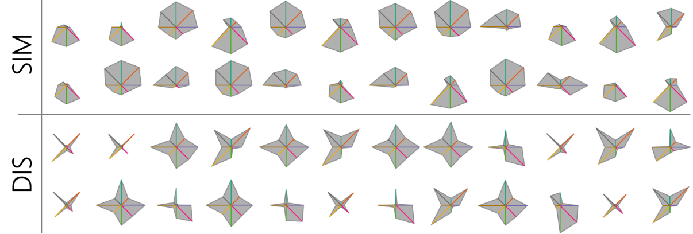

# star-glyph-ordering

### What is this tool about?

Star Glyphs are a well-researched visualization technique to visualize multi-dimensional data, often used in small multiple settings for a visual comparison of many data points. 
However, the overall visual appearance of Star Glyphs is strongly influenced by the ordering of dimensions. 
An example is shown in the figure below, where the same set of data points are visualized by similarity and dissimilarity ordering. 
This tool allows user to upload their own data set and examine different dimension orderings of Star Glyphs.
 
 

 
 
For more details, please see paper: Evaluating Ordering Strategies of Star Glyph Axes

### How to use this tool?
To use this tool, you need two steps:
1. Upload your data in .csv format(first column as index and other dimensions on numerical scale)
2. Choose a dimension ordering technique
